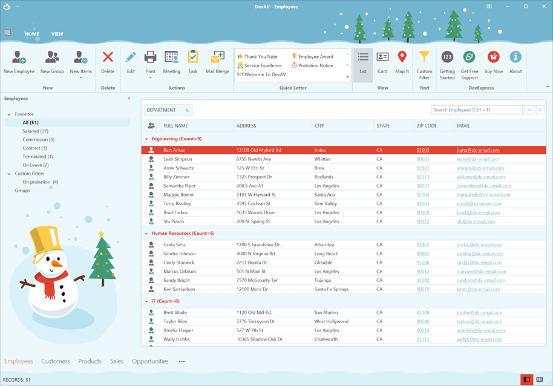

<!-- default badges list -->

[](https://supportcenter.devexpress.com/ticket/details/T1045057)
[](https://docs.devexpress.com/GeneralInformation/403183)
[](#does-this-example-address-your-development-requirementsobjectives)
<!-- default badges end -->

# DevExpress Winter Joy Skin

<a href="https://www.nuget.org/packages/DevExpress.Win.WinterJoySkin/"></a>

Get into the festive mood with our special Winter Joy theme skin for DevExpress Windows Forms controls. 

You can get this skin here on GitHub or as a [NuGet package](#nuget-package).



## Add Winter Joy Skin to Your Project

The current repository contains the skin library ([DevExpress.WinterJoySkin.dll](./Lib/DevExpress.WinterJoySkin.dll)) that you can add directly to the References section of your project.

### NuGet Package

You can also obtain the skin library as a NuGet package at [DevExpress.Win.WinterJoySkin](https://www.nuget.org/packages/DevExpress.Win.WinterJoySkin).
Run the following command in the Package Manager Console to install the package:

```
Install-Package DevExpress.Win.WinterJoySkin -Version 1.0.2
```

## Register and Apply Skin

Once you include the Winter Joy skin library in your project, add the following skin registration code:

```cs
[STAThread]
static void Main() {
    // Register the Winter Joy skin.
    System.Reflection.Assembly asm = typeof(DevExpress.UserSkins.WinterJoy).Assembly; 
    DevExpress.XtraEditors.WindowsFormsSettings.RegisterUserSkins(asm); 
    // Apply the skin.
    DevExpress.XtraEditors.WindowsFormsSettings.DefaultLookAndFeel.SetSkinStyle("Winter Joy");
    //
    Application.Run(...);
}
```

```vb
Partial Public Class Form1
    Shared Sub New()
        ' Register the Winter Joy skin.
        Dim asm As Reflection.Assembly = GetType(DevExpress.UserSkins.WinterJoy).Assembly
        DevExpress.XtraEditors.WindowsFormsSettings.RegisterUserSkins(asm)
        ' Apply the skin.
        DevExpress.XtraEditors.WindowsFormsSettings.DefaultLookAndFeel.SetSkinStyle("Winter Joy")
    End Sub
    Public Sub New()
        InitializeComponent()
    End Sub
End Class
```

## Personalize Winter Joy Skin

The [WinForms Skin Editor](https://docs.devexpress.com/SkinEditor/1630/winforms-skin-editor) tool allows you to customize the WinterJoy skin (as well as any other DevExpress skins). Open the skin project (the `/Skin/Winter Joy/Winter Joy.skin` file) in the Skin Editor, and modify default colors, images, and padding settings. Save changes and generate a new skin library, as demonstrated in the following help topic: [Export and Apply Custom Skins](https://docs.devexpress.com/SkinEditor/2546/export-and-apply-custom-skins).

## Documentation 

- [WinForms Skin Editor](https://docs.devexpress.com/SkinEditor/1630/winforms-skin-editor)
- [Export and Apply Custom Skins](https://docs.devexpress.com/SkinEditor/2546/export-and-apply-custom-skins)
- [Install DevExpress Controls Using NuGet Packages](https://docs.devexpress.com/GeneralInformation/115912/installation/install-devexpress-controls-using-nuget-packages)
<!-- feedback -->
## Does this example address your development requirements/objectives?

[](https://www.devexpress.com/support/examples/survey.xml?utm_source=github&utm_campaign=winforms-winter-joy-skin&~~~was_helpful=yes) [](https://www.devexpress.com/support/examples/survey.xml?utm_source=github&utm_campaign=winforms-winter-joy-skin&~~~was_helpful=no)

(you will be redirected to DevExpress.com to submit your response)
<!-- feedback end -->
